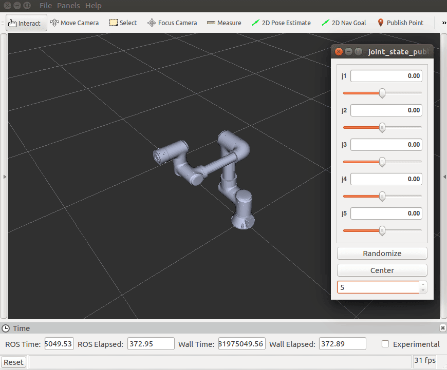

# README

此package為計畫使用機器人的URDF





## 測試

Download and check out to "ros2" branch

```shell
cd ros2_ws/src
git clone https://github.com/howardloop/rs_m90e7_description.git -b ros2 
```

Build

```bash
cd ~/ros2_ws/
colcon build
# source ~/ros2_ws/install/setup.bash
```

Run

```shell
ros2 launch rs_m90e7_description display.launch
```

