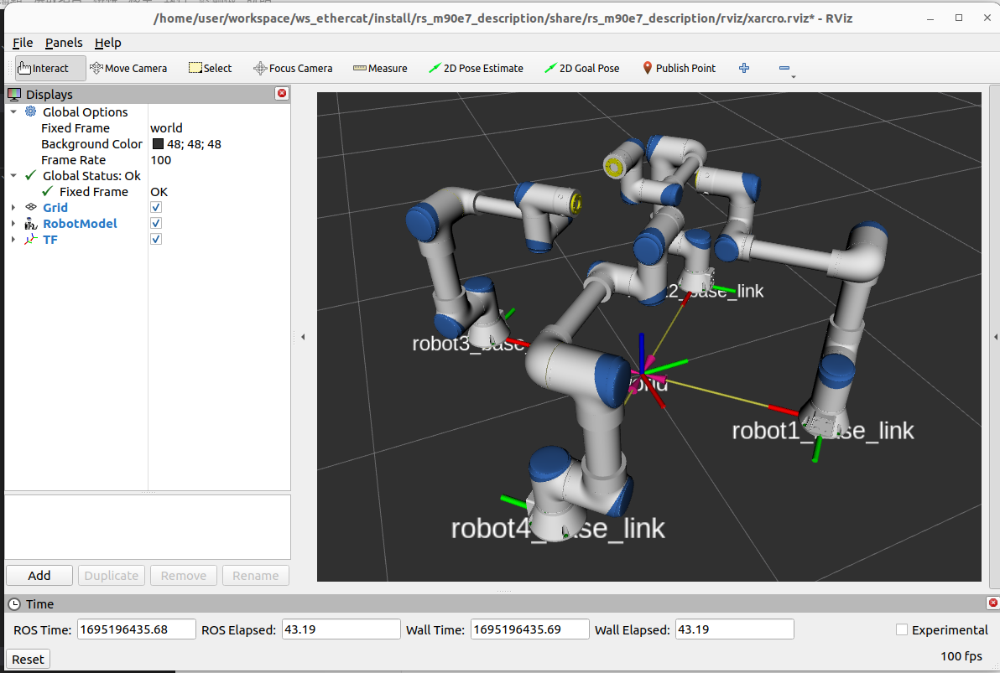
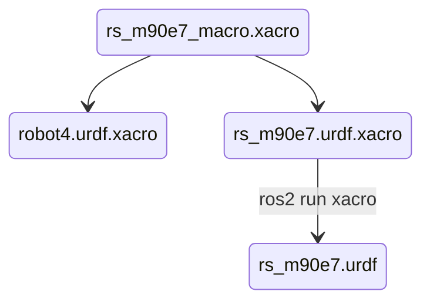

# README

此package為計畫使用機器人的URDF


## 測試

**Download and check out to "ros2" branch**

```shell
cd ros2_ws/src
git clone https://github.com/howardloop/rs_m90e7_description.git -b ros2 
```


**Build**

```bash
cd ~/ros2_ws/

# colcon build
colcon build --symlink-install --packages-select rs_m90e7_description

# source ~/ros2_ws/install/setup.bash
```


**install exec depend**

```shell
rosdep install --from-paths ~/ros2_ws/src/rs_m90e7_description
```


**Run**

```shell
ros2 launch rs_m90e7_description display.launch.py
```


```shell
ros2 launch rs_m90e7_description display_xacro.launch.py
```




## Note

幾個URDF與XACRO檔案的關係如下，所以要動到機械參數請直接修改rs_m90e7_macro.xacro即可

└── urdf

​    ├── **robot4.urdf.xacro**

​    ├── rs_m90e7

​    │   └── **rs_m90e7_macro.xacro**

​    ├── **rs_m90e7.urdf**

​    └── **rs_m90e7.urdf.xacro**



`rs_m90e7.urdf` 透過下列指令來產生

```shell
cd urdf/
ros2 run xacro xacro rs_m90e7.urdf.xacro > rs_m90e7.urdf
```


## 質量參數

質量、質心位置與慣性矩皆是是估測值，真實數值依廠商提供為主。

