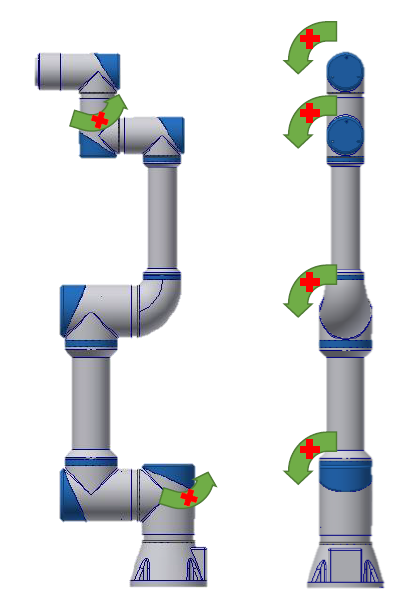
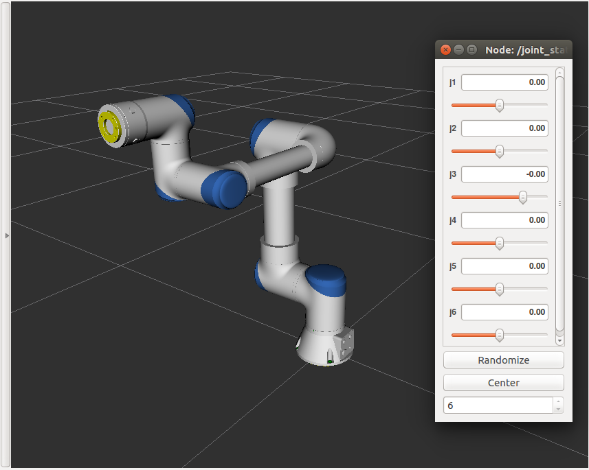
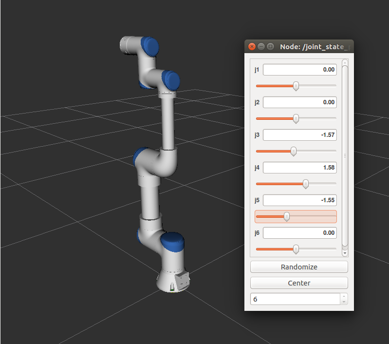

# README

此package為計畫使用機器人的URDF









## 測試

Download and check out ot **ros1** branch

```shell
cd ~/catkin_ws/src
git clone https://github.com/howardloop/rs_m90e7_description.git -b ros1
```

Run

```bash
roslaunch rs_m90e7_description display.launch
```

